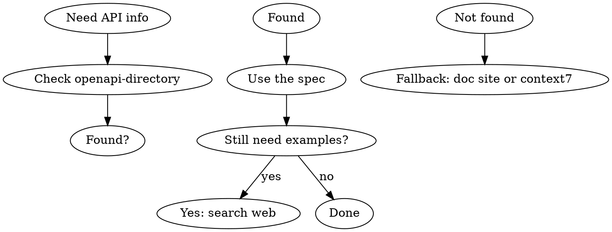

# OpenAPI Directory First

## Overview

Always check the [APIs-guru/openapi-directory](https://github.com/APIs-guru/openapi-directory) for authoritative, machine-readable API specs before relying on training data or web searches. This directory contains 2500+ public API definitions in OpenAPI format, auto-updated weekly from original sources.

**Core rule:** Training data goes stale. OpenAPI specs are the source of truth.

## When to Use

- Writing code that calls any public REST API
- Looking up endpoint parameters, auth, request/response schemas
- Debugging API integration issues (wrong params, unexpected responses)
- Generating API client code or types
- Answering questions about how a public API works

## When NOT to Use

- Internal/private APIs (not in the directory)
- GraphQL APIs (directory is REST/OpenAPI only)
- When you already have the project's own OpenAPI spec locally

## The Workflow



## How to Look Up

### Step 1: Find the API

Search the directory for the provider domain:

```bash
# List available APIs for a provider
curl -s "https://api.github.com/repos/APIs-guru/openapi-directory/contents/APIs/{provider.com}" | python3 -c "
import json,sys
data=json.load(sys.stdin)
for item in data:
    print(f'{item[\"name\"]}')" 
```

Common provider domains: `stripe.com`, `github.com`, `spotify.com`, `amazonaws.com`, `googleapis.com`, `microsoft.com`, `twilio.com`, `slack.com`, `shopify.com`, `paypal.com`, `sendgrid.com`, `notion.com`, `figma.com`

### Step 2: Pick the latest version

Providers often have multiple API versions. Use the most recent dated folder.

### Step 3: Fetch the spec

```
https://raw.githubusercontent.com/APIs-guru/openapi-directory/main/APIs/{provider.com}/{version}/openapi.yaml
```

Example — Stripe API:
```
https://raw.githubusercontent.com/APIs-guru/openapi-directory/main/APIs/stripe.com/2022-11-15/openapi.yaml
```

### Step 4: Extract what you need

The OpenAPI spec contains:
- **`paths/`** — All endpoints with methods, parameters, request bodies, responses
- **`components/schemas/`** — Data models with types and validation rules
- **`security/`** — Auth schemes (API key, OAuth, Bearer, etc.)
- **`servers/`** — Base URLs

### Quick Check: Does this API exist?

```bash
curl -s "https://api.apis.guru/v2/list.json" | python3 -c "
import json,sys
data=json.load(sys.stdin)
matches = [k for k in data if 'SEARCH_TERM' in k.lower()]
for m in matches:
    versions = list(data[m]['versions'].keys())
    print(f'{m}: {versions[-1]}')
"
```

## Common Mistakes

| Mistake | Fix |
|---------|-----|
| Guessing parameter types from memory | Read the actual schema from the spec |
| Using outdated endpoint paths | Check the latest version in the directory |
| Assuming auth scheme | Read `security` and `securitySchemes` from the spec |
| Skipping this step because "I know the API" | You don't. Specs change. Always check. |
| Only reading partial spec | Use the full file, not just endpoints you think you need |

## Key Facts

- **2500+ APIs** indexed with OpenAPI 2.0 and 3.x specs
- **Auto-updated weekly** from original sources via `x-origin` URLs
- **Free, no API key needed** — raw GitHub URLs just work
- Specs are **validated** before commit (80% of upstream specs have errors that get fixed)
- Provider naming: `{domain}:{api_name}` for multi-API providers (e.g., `googleapis.com:youtube`)
